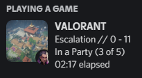
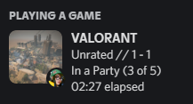

```
 _   _____   __   ____  ___  ___   _  ________                
| | / / _ | / /  / __ \/ _ \/ _ | / |/ /_  __/__________  ____
| |/ / __ |/ /__/ /_/ / , _/ __ |/    / / / /___/ __/ _ \/ __/
|___/_/ |_/____/\____/_/|_/_/ |_/_/|_/ /_/     /_/ / .__/\__/ 
                                                  /_/         
```
[![Discord][discord-shield]][discord-url]
[![License][license-shield]][license-url]
[![Stars][stars-shield]][stars-url]
[![Forks][forks-shield]][forks-url]
[![Releases][releases-shield]][releases-url]
[![Language][language-shield]][language-url]

<!-- TABLE OF CONTENTS -->
<details open="open">
  <summary>Table of Contents</summary>
  <ol>  
    <li><a href="demo">Demo</a></li>
    <li><a href="installation">Installation</a></li>
    <li><a href="#usage">Usage</a></li>
    <li><a href="#license">License</a></li>
    <li><a href="#support">Support</a></li>
    <li><a href="#disclaimer">Disclaimer</a></li>
  </ol>

 
 
<!-- DEMO --> 
## Demo
<a>
    
    
</a>

 
 
<!-- INSTALLATION --> 
## Installation
- Download the latest [release](https://github.com/colinhartigan/valorant-rpc/releases/) and run it.

 
 
<!-- USAGE -->
## Usage
- Run the program instead of launching VALORANT
     - If VALORANT is not running, the program will launch it for you
- If VALORANT is already running, launch the program and the presence will start


<!-- LICENSE -->
## License
Click [here](license-url) for the license.
 

<!-- SUPPORT -->
## Support
Either make an issue or:
[![Discord][discord-shield]][discord-url]
 
 
 
<!-- DISCLAIMER -->
## Disclaimer 
This project is not affiliated with Riot Games or any of its employees and therefore does not reflect the views of said parties. This is purely a fan-made project to enhance VALORANT's skin inventory management.

Riot Games does not endorse or sponsor this project. Riot Games, and all associated properties are trademarks or registered trademarks of Riot Games, Inc.
 
<!-- MARKDOWN LINKS & IMAGES -->
[discord-shield]: https://img.shields.io/discord/860288779558715402?color=7289da&label=Support&logo=discord&logoColor=7289da&style=for-the-badge
[discord-url]: https://discord.gg/uGuswsZwAT
[license-shield]: https://img.shields.io/github/license/colinhartigan/valorant-rpc?style=for-the-badge
[license-url]: https://github.com/colinhartigan/valorant-rpc/blob/v3/LICENSE.txt
[stars-shield]: https://img.shields.io/github/stars/colinhartigan/valorant-rpc?logo=github&style=for-the-badge
[stars-url]: https://github.com/colinhartigan/valorant-rpc/stargazers
[forks-shield]: https://img.shields.io/github/forks/colinhartigan/valorant-rpc?logo=github&style=for-the-badge
[forks-url]: https://github.com/colinhartigan/valorant-rpc/network/members
[releases-shield]: https://img.shields.io/github/downloads/colinhartigan/valorant-rpc/total?style=for-the-badge
[releases-url]: https://github.com/colinhartigan/valorant-rpc/releases
[language-shield]: https://img.shields.io/github/languages/top/colinhartigan/valorant-rpc?logo=python&logoColor=yellow&style=for-the-badge
[language-url]: https://www.python.org/

